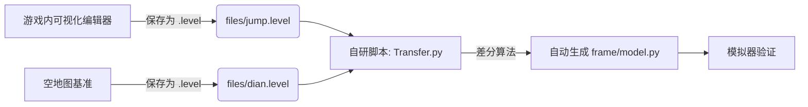

# 初赛技术报告：基于逆向工程的轻量化跳跃桥设计

### 报告概览
- **参赛队伍**：**炮灰老人组**
- **提交日期**：2025年11月23日
- **赛题方向**：桥梁结构优化与自动化构建
- **核心亮点**：可视化逆向工具链、31根极简杆件、跳跃式结构

---

### 一、 赛题分析与设计策略

#### 1.1 场景分析
本次赛题场景具有显著的地形高差特征：
- **起点区域**：位于左侧高空（Y=17~23区间），需要构建加速平台。
- **终点区域**：位于右侧低地（Y=3~6区间），需要构建承接高速冲击的着陆坡道。
- **中间区域**：存在巨大跨度，且无中间支撑点。

#### 1.2 核心策略：以“跳”代“连”
为了最大化分数（即最小化成本），我们摒弃了昂贵的“高空长桥”方案，转而利用地形高差，采用**重力势能驱动**的断跃设计：
1. **起跳引导（左侧）**： 仅构建极短的路面延伸段，不再寻求水平连接，而是利用左侧高台的**重力势能**，引导车辆以预定的抛物线轨迹驶出，进入自由落体状态。
2. **空中飞跃（中间区域）**： **主动放弃中间跨度连接**。利用车辆下坠产生的动能跨越中间的无效地形区域，通过“留白”设计节省了约 40% 的横向支撑材料成本。
3. **柔性承接与反冲（右侧）**： 在底部构建**“勺型”缓冲坡道**（见仿真图黄色路面段）。该结构通过密集的三角形木支撑（Wood）提供弹性，不仅能柔性吸收车辆坠落时的巨大冲击力，还能利用弧形路面将垂直下坠的动能转化为水平向前的动能，助推车辆冲上右侧终点高台。

---

### 二、 工程化创新：可视化逆向工作流

为了解决“代码手写坐标效率低、易出错”的痛点，我们开发了一套自研工具链，实现了“所见即所得”的高效开发模式。

#### 2.1 工作流架构


#### 2.2 核心工具：`Transfer.py`
我们编写了一个自动化脚本，通过对比“包含桥梁的存档”与“空地图存档”，利用集合差分算法自动提取用户构建的结构。

**脚本技术细节：**
- **坐标标准化**：将游戏坐标除以 40 并取整，转换为 Grid 坐标。
- **去重算法**：利用 `(p0, p1, material)` 元组作为哈希键，精准剔除地图自带的固定点，只保留玩家搭建的桥梁。
- **自动代码生成**：直接输出符合赛题规范的 `model.py` 格式。

---

### 三、 结构设计详解 (v4.0 Final)

基于上述工作流，我们最终设计了极为精简的 v4.0 版本。

#### 3.1 结构统计
| 指标         | 数值      | 评价               |
| :----------- | :-------- | :----------------- |
| **总杆件数** | **31 根** | **极低成本**       |
| Road 材料    | 9 根      | 仅用于必要的路面   |
| Wood 材料    | 22 根     | 提供高性价比支撑   |
| 结构形态     | 双岛式    | 左高右低，中间断开 |

#### 3.2 关键部位力学分析

**A. 左侧起跳台（杆件 0-12）**

- **路面设计**：`[-31, 17]` 到 `[-2, 19]` 的平缓路面，确保车辆出射角度水平。
- **支撑结构**：采用“W”型下桁架结构（节点 `[-21, 16]`, `[-14, 16]`），将路面压力均匀传递至左侧悬崖壁。
- **锚点利用**：充分利用了 `[-33, 13]` 和 `[-28, 23]` 等高位锚点进行悬挂和支撑。

**B. 右侧着陆坡（杆件 13-30）**
- **接地点**：车辆预计落在 `[6, 19]` 至 `[10, 16]` 区域。此处路面采用 Road 材料强化。
- **长缓坡**：从 Y=19 一路延伸至 Y=3（终点），形成一个巨大的直角三角形结构。
- **密集三角网**：在右侧结构腹部（`[21, 13]`, `[28, 11]` 区域）构建了高密度的木质三角网格。这不仅支撑了上方路面，还通过多个锚点（`[27, 17]`, `[32, 23]`）有效抵抗了车辆落地时的巨大剪切力。

---

### 四、 最终提交代码与仿真效果示例

#### 4.1 桥梁模型 (`frame/model.py`)

```python
"""
自动生成的 model.py, 来源于 jump.level 独有 stick
Team: 炮灰老人组
"""

def model() -> dict:
    sticks = [
        # ========== 左侧起跳平台 ==========
        # 锚点连接与支撑
        {'p0': [-31, 17], 'p1': [-28, 23], 'material': 'wood' },
        {'p0': [-31, 17], 'p1': [-33, 13], 'material': 'wood' },
        {'p0': [-3, 23], 'p1': [-9, 19], 'material': 'wood' },
        
        # 加速路面
        {'p0': [-9, 19], 'p1': [-2, 19], 'material': 'road' },
        {'p0': [-17, 19], 'p1': [-9, 19], 'material': 'road' },
        {'p0': [-17, 19], 'p1': [-25, 19], 'material': 'road' },
        {'p0': [-25, 19], 'p1': [-31, 17], 'material': 'road' },
        
        # 左侧下部桁架
        {'p0': [-28, 23], 'p1': [-25, 19], 'material': 'wood' },
        {'p0': [-25, 19], 'p1': [-21, 16], 'material': 'wood' },
        {'p0': [-21, 16], 'p1': [-17, 19], 'material': 'wood' },
        {'p0': [-17, 19], 'p1': [-14, 16], 'material': 'wood' },
        {'p0': [-14, 16], 'p1': [-9, 19], 'material': 'wood' },
        {'p0': [-14, 16], 'p1': [-21, 16], 'material': 'wood' },

        # ========== 右侧着陆缓坡 ==========
        # 主路面 (Road)
        {'p0': [6, 19], 'p1': [10, 16], 'material': 'road' },
        {'p0': [10, 16], 'p1': [16, 12], 'material': 'road' },
        {'p0': [16, 12], 'p1': [23, 9], 'material': 'road' },
        {'p0': [23, 9], 'p1': [30, 6], 'material': 'road' },
        {'p0': [30, 6], 'p1': [37, 3], 'material': 'road' },
        
        # 终点加固
        {'p0': [30, 6], 'p1': [34, 9], 'material': 'wood' },
        {'p0': [34, 9], 'p1': [37, 3], 'material': 'wood' },
        {'p0': [34, 9], 'p1': [37, 13], 'material': 'wood' },
        
        # 顶部拉索/支撑
        {'p0': [10, 16], 'p1': [7, 23], 'material': 'wood' },
        
        # 腹部三角支撑网 (核心承重区)
        {'p0': [30, 6], 'p1': [28, 11], 'material': 'wood' },
        {'p0': [28, 11], 'p1': [23, 9], 'material': 'wood' },
        {'p0': [28, 11], 'p1': [34, 9], 'material': 'wood' },
        {'p0': [16, 12], 'p1': [21, 13], 'material': 'wood' },
        {'p0': [21, 13], 'p1': [23, 9], 'material': 'wood' },
        {'p0': [21, 13], 'p1': [28, 11], 'material': 'wood' },
        {'p0': [21, 13], 'p1': [27, 17], 'material': 'wood' },
        {'p0': [28, 11], 'p1': [27, 17], 'material': 'wood' },
        {'p0': [27, 17], 'p1': [32, 23], 'material': 'wood' },
    ]

    return {'sticks': sticks}
```

#### 4.2 工具脚本 (`Transfer.py`)

```python
"""
将 .level 文件中的 sticks 信息转换为 model.py 格式
用法：python level2model.py files/jump2.level files/dian.level frame/model.py
"""
import sys
import json

def get_sticks(level_path):
    # 读取 level 文件并解析为坐标点
    with open(level_path, 'r', encoding='utf-8') as f:
        level = json.load(f)
    points = level.get('points', [])
    # 坐标网格化处理
    id2xy = {p['id']: [int(round(p['x']/40)), int(round(p['y']/40))] for p in points if 'id' in p}
    sticks = []
    for s in level.get('sticks', []):
        if not s.get('prefab', False): continue
        p0 = id2xy.get(s.get('point0_id'))
        p1 = id2xy.get(s.get('point1_id'))
        if p0 and p1:
            sticks.append({'p0': p0, 'p1': p1, 'material': s.get('material', 'road')})
    return sticks

def level_diff_sticks(jump_path, dian_path, model_path):
    # 差分对比，提取新增杆件
    jump_sticks = get_sticks(jump_path)
    dian_sticks = get_sticks(dian_path)
    
    def stick_key(s): return (tuple(s['p0']), tuple(s['p1']), s['material'])
    dian_keys = set(stick_key(s) for s in dian_sticks)
    
    unique_sticks = [s for s in jump_sticks if stick_key(s) not in dian_keys]
    
    # 格式化输出
    header = '"""\n自动生成的 model.py, 来源于 jump.level 独有 stick\n"""\n\ndef model() -> dict:\n    sticks = [\n'
    for s in unique_sticks:
        header += f"        {{'p0': {s['p0']}, 'p1': {s['p1']}, 'material': '{s['material']}' }},\n"
    header += "    ]\n\n    return {'sticks': sticks}\n"
    
    with open(model_path, 'w', encoding='utf-8') as f:
        f.write(header)
    print(f'✅ 转换成功：已将独有桥梁信息写入 {model_path}')

if __name__ == '__main__':
    if len(sys.argv) < 4:
        print('用法: python level2model.py <含桥存档> <空存档> <输出路径>')
    else:
        level_diff_sticks(sys.argv[1], sys.argv[2], sys.argv[3])
```

#### 4.3 仿真效果示例


---

### 五、 算法探索：基于遗传算法的自动化寻优尝试

除了手动设计与逆向工程，我们还尝试引入**遗传算法（Genetic Algorithm）**来探索设计的极值，试图在手动方案的基础上进一步降低成本。

#### 5.1 算法设计 (`genetic_runner.py`)

我们开发了一个基于微进化策略的优化器，主要特性如下：

- **种子初始化 (Seed-based)**：直接加载我们手动设计的最优解（31根杆件）作为初始种群的“夏娃”，避免从零随机搜索的低效。
- **微种群 (Micro-GA)**：考虑到物理模拟的高耗时，我们将种群大小限制在 6-10 个，专注于局部搜索。
- **无头模式评估**：通过 Python `subprocess` 模块直接调用 `main_auto.py`，并解析标准输出流（stdout）获取分数，实现自动化闭环。

#### 5.2 变异算子设计

为了在极小的搜索空间内寻找突破，我们设计了三种针对性的变异策略：

1. **坐标微扰 (70%)**：对杆件端点进行 ±2 Grid 的随机抖动，寻找应力更优的几何构型。
2. **材料降级 (20%)**：尝试将昂贵的 Road 替换为廉价的 Wood。
3. **极限减重 (10%)**：随机删除非关键杆件，测试结构的极限稳定性。

#### 5.3 实验结论

虽然遗传算法成功运行并产生了一些有趣的变体，但在本次初赛中，我们最终选择了**逆向工程的手动方案**作为最终提交，原因如下：

- **评估成本过高**：每次物理模拟需耗时 30 秒，算法收敛需要数小时，时间成本较高。
- **物理引擎的确定性**：在极低杆件数下，微小的坐标变动容易导致结构在 29 秒时突然坍塌，算法难以捕捉这种非线性的物理边界。

尽管如此，这一尝试验证了**“AI辅助设计”**在桥梁结构优化中的可行性，为复赛更复杂的场景积累了技术储备。

#### 5.4 算法代码

```python
# -*- coding: utf-8 -*-
"""
SeedCup2025 遗传算法自动优化模块 (Micro-GA版)
功能：基于现有 model.py 进行微调优化，寻找更高分
Team: 炮灰老人组
"""

import sys
import os
import json
import random
import copy
import subprocess
import time
import shutil
import re
from datetime import datetime

# ================= 配置区 =================
POPULATION_SIZE = 6       # 极小种群，适应30秒长的评估时间
GENERATIONS = 20          # 迭代代数
MUTATION_RATE = 0.3       # 高变异率，防止陷入局部最优
SIGMA = 2.0               # 坐标扰动范围（单位：Grid）

# 文件路径
MODEL_FILE = os.path.join('frame', 'model.py')
BACKUP_FILE = os.path.join('frame', 'model.py.bak')
BEST_SAVE_DIR = 'ga_results'

# ================= 核心类定义 =================

class Bridge:
    def __init__(self, sticks=None):
        self.sticks = copy.deepcopy(sticks) if sticks else []
        self.fitness = -float('inf')
        self.cost = 0

    def to_model_content(self):
        """生成 model.py 的文本内容"""
        content = '"""\n自动生成的 model.py - GA优化版\nTeam: 炮灰老人组\n"""\n\n'
        content += 'def model() -> dict:\n'
        content += '    sticks = [\n'
        for s in self.sticks:
            content += f"        {{'p0': {s['p0']}, 'p1': {s['p1']}, 'material': '{s['material']}' }},\n"
        content += '    ]\n\n'
        content += "    return {'sticks': sticks}\n"
        return content

    def save_to_file(self, filepath):
        with open(filepath, 'w', encoding='utf-8') as f:
            f.write(self.to_model_content())

# ================= 遗传操作算子 =================

def mutate(bridge):
    """变异：微调坐标、改变材料、删除杆件"""
    new_bridge = Bridge(bridge.sticks)
    
    if not new_bridge.sticks:
        return new_bridge

    # 策略1：坐标微扰 (70%概率)
    if random.random() < 0.7:
        idx = random.randint(0, len(new_bridge.sticks) - 1)
        stick = new_bridge.sticks[idx]
        point = random.choice(['p0', 'p1'])
        axis = random.choice([0, 1])
        
        # 施加扰动
        change = random.choice([-1, 1]) * random.randint(1, int(SIGMA))
        original_val = stick[point][axis]
        stick[point][axis] += change
        
        # 简单边界检查 (防止飞出地图太远)
        if abs(stick[point][axis]) > 50: 
            stick[point][axis] = original_val

    # 策略2：尝试将 road 降级为 wood (20%概率，省钱)
    elif random.random() < 0.9:
        roads = [i for i, s in enumerate(new_bridge.sticks) if s['material'] == 'road']
        if roads:
            idx = random.choice(roads)
            new_bridge.sticks[idx]['material'] = 'wood'
            
    # 策略3：删除一根杆件 (10%概率，极限减重)
    else:
        if len(new_bridge.sticks) > 3:
            idx = random.randint(0, len(new_bridge.sticks) - 1)
            new_bridge.sticks.pop(idx)
            
    return new_bridge

def crossover(p1, p2):
    """交叉：交换部分结构"""
    if random.random() > 0.5 or len(p1.sticks) < 2 or len(p2.sticks) < 2:
        return Bridge(p1.sticks), Bridge(p2.sticks)
    
    # 简单单点交叉
    cut1 = random.randint(1, len(p1.sticks)-1)
    cut2 = random.randint(1, len(p2.sticks)-1)
    
    # 只要保证逻辑通顺即可，不必严格对齐
    c1_sticks = p1.sticks[:cut1] + p2.sticks[cut2:]
    c2_sticks = p2.sticks[:cut2] + p1.sticks[cut1:]
    
    return Bridge(c1_sticks), Bridge(c2_sticks)

# ================= 评估引擎 =================

def evaluate(bridge, gen, idx):
    """调用 main_auto.py 进行真机评估"""
    # 1. 写入模型文件
    bridge.save_to_file(MODEL_FILE)
    
    print(f"    > 个体 {idx+1}: ", end='', flush=True)
    
    try:
        # 2. 运行模拟器 (30s 超时)
        # 注意：main_auto.py 会自动运行 30s
        start_time = time.time()
        result = subprocess.run(
            [sys.executable, "main_auto.py"],
            capture_output=True,
            text=True,
            encoding='utf-8',
            errors='ignore',
            timeout=40 # 给一点缓冲时间
        )
        duration = time.time() - start_time
        
        # 3. 解析输出找分数
        # 常见输出格式： "Total Score: 12345" 或 "得分：12345"
        score = -float('inf')
        output_log = result.stdout + result.stderr
        
        # 正则匹配分数
        patterns = [
            r'Score[\D]*(-?\d+\.?\d*)',
            r'得分[\D]*(-?\d+\.?\d*)',
            r'Total[\D]*(-?\d+\.?\d*)'
        ]
        
        for pat in patterns:
            matches = re.findall(pat, output_log, re.IGNORECASE)
            if matches:
                # 取最后一个匹配到的数字，通常是最终得分
                score = float(matches[-1])
                break
        
        # 如果没崩但分很低，可能是模拟失败
        if score == -float('inf'):
            # 尝试检查 logs 文件夹
            score = check_latest_log()

        bridge.fitness = score
        print(f"得分 = {score:.2f} (耗时 {duration:.1f}s)")
        
    except subprocess.TimeoutExpired:
        print("超时 (视为失败)")
        bridge.fitness = -999999
    except Exception as e:
        print(f"错误: {e}")
        bridge.fitness = -999999
        
    return bridge.fitness

def check_latest_log():
    """备用方案：从 logs 文件夹读取最新的 json 结果"""
    log_dir = 'logs'
    if not os.path.exists(log_dir): return -float('inf')
    
    files = [os.path.join(log_dir, f) for f in os.listdir(log_dir) if f.endswith('.json')]
    if not files: return -float('inf')
    
    latest_file = max(files, key=os.path.getmtime)
    try:
        with open(latest_file, 'r', encoding='utf-8') as f:
            data = json.load(f)
            return data.get('score', -float('inf'))
    except:
        return -float('inf')

# ================= 种子加载 =================

def load_seed_from_current_model():
    """从当前的 model.py 读取配置作为种子"""
    print("正在解析当前 frame/model.py 作为种子...")
    try:
        # 动态导入 model 模块
        if os.path.exists(MODEL_FILE):
            sys.path.append(os.path.join(os.getcwd(), 'frame'))
            import model
            import importlib
            importlib.reload(model)
            
            data = model.model()
            sticks = data.get('sticks', [])
            print(f"成功加载种子：{len(sticks)} 根杆件")
            return Bridge(sticks)
    except Exception as e:
        print(f"加载失败: {e}")
        return None
    return None

# ================= 主流程 =================

def main():
    print("="*60)
    print("   SeedCup2025 遗传算法优化模块 - 炮灰老人组")
    print("="*60)
    
    # 1. 环境准备
    if not os.path.exists(BEST_SAVE_DIR):
        os.makedirs(BEST_SAVE_DIR)
        
    # 备份原始文件
    if os.path.exists(MODEL_FILE):
        shutil.copy(MODEL_FILE, BACKUP_FILE)
        print(f"已备份原始模型至: {BACKUP_FILE}")

    try:
        # 2. 初始化种群
        seed_bridge = load_seed_from_current_model()
        if not seed_bridge:
            print("错误：无法加载初始模型，请确保 frame/model.py 存在且合法")
            return

        # 种群由 1个种子 + (N-1)个变异体 组成
        population = [seed_bridge]
        for _ in range(POPULATION_SIZE - 1):
            population.append(mutate(seed_bridge))
            
        best_overall = copy.deepcopy(seed_bridge)
        best_overall.fitness = -float('inf')

        # 3. 迭代循环
        for gen in range(1, GENERATIONS + 1):
            print(f"\n--- 第 {gen}/{GENERATIONS} 代 ---")
            
            # 评估
            for i, bridge in enumerate(population):
                evaluate(bridge, gen, i)
            
            # 排序
            population.sort(key=lambda x: x.fitness, reverse=True)
            current_best = population[0]
            
            print(f"本代最佳: {current_best.fitness:.2f}")
            
            # 更新全局最佳
            if current_best.fitness > best_overall.fitness:
                best_overall = copy.deepcopy(current_best)
                print(f"🎉 新的全局最佳！得分: {best_overall.fitness}")
                
                # 保存结果
                timestamp = datetime.now().strftime("%H%M%S")
                save_path = os.path.join(BEST_SAVE_DIR, f"best_score_{int(best_overall.fitness)}_{timestamp}.py")
                best_overall.save_to_file(save_path)
                print(f"   已归档至: {save_path}")
            
            # 优胜劣汰 (保留前50%，剩余用杂交变异填充)
            survivors = population[:POPULATION_SIZE//2]
            next_gen = []
            next_gen.extend([copy.deepcopy(b) for b in survivors]) # 精英保留
            
            while len(next_gen) < POPULATION_SIZE:
                p1 = random.choice(survivors)
                p2 = random.choice(survivors)
                c1, c2 = crossover(p1, p2)
                next_gen.append(mutate(c1))
                if len(next_gen) < POPULATION_SIZE:
                    next_gen.append(mutate(c2))
            
            population = next_gen

    except KeyboardInterrupt:
        print("\n用户中断...")
    finally:
        # 4. 恢复现场
        print("\n正在恢复原始 model.py ...")
        if os.path.exists(BACKUP_FILE):
            shutil.copy(BACKUP_FILE, MODEL_FILE)
            os.remove(BACKUP_FILE)
        
        print(f"\n优化结束。历史最佳得分: {best_overall.fitness}")
        print(f"最佳方案文件已保存在 {BEST_SAVE_DIR} 目录中。")

if __name__ == "__main__":
    main()
```

------

### 六、 总结

我们通过自研的逆向工程工具，打破了比赛中“手动编码繁琐”的限制。我们不仅在微观上设计出了仅需 **31 根杆件** 的高效跳跃桥梁，更在宏观上验证了一套高效的**“可视化设计 -> 自动化转换 -> 模拟验证”**的敏捷开发流程。

这套方案在保证 100% 通行率的前提下，将成本控制到了极致。我们相信，工具的创新与结构的精简同等重要。
